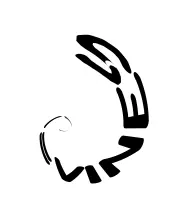
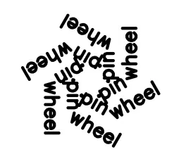
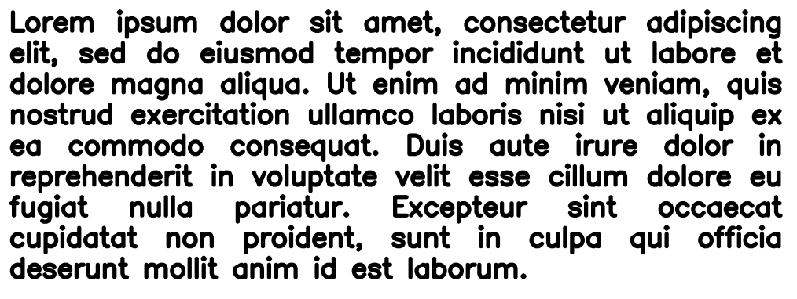
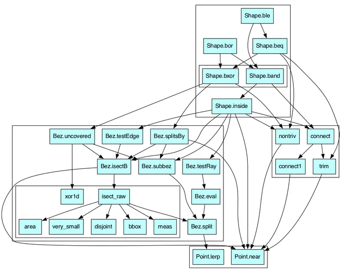
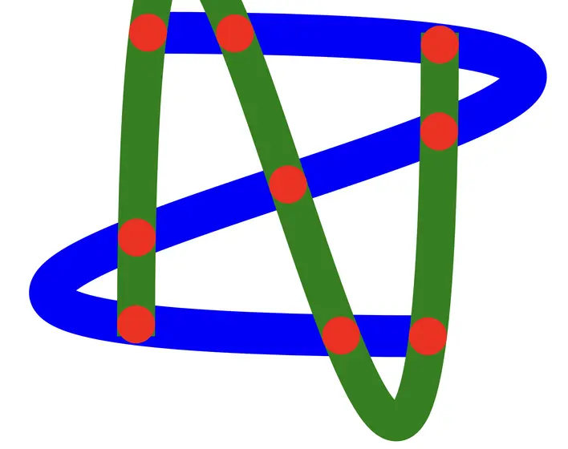
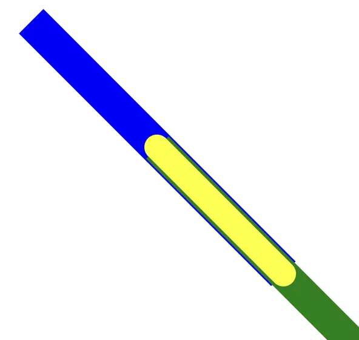

## Fantastic Parakeet

Fantastic Parakeet is a lo-dep (`dataclasses`,`math`,`pickle`,`sys`) package performing boolean operations on Bézier paths.

It builds from 2D-points up through Bézier paths, `xor` and `and` operations on them, to general boolean operations on those paths, and layers Euclidean as well as non-Euclidean transformations on top.

These [presentations](https://davelongpresentations.rcdis.co/) covering the implementation:
- Tricky Boundary Decisions w/ Bézier booleans (5 min)
- Totally Béziers: Deepdive (12 min + 6 min questions)

were given at the [Recurse Center](https://www.recurse.com/) during the Fall 1 2025 batch.

## font.py

`font.py` presents a command-line interface to a font-rendering engine built on top of the basic boolean operations.

It allows for both non-Euclidean transformations:

and Eucliean transformations of text:

as well as more traditional text layout:

and limited styling: bold, italic, strikeout, and their combinations.

## cpg.py

`cpg` implements over a 1'000 (property-based tests)[docs/pbt.md], or over 3 tests per engine line of source code.

The bézier boolean operation engine is built as follows:

where everything ultimately rests on only two primitives:

- calculating a new point between two given points, and
- detecting intersection:

and overlap:

betwween pairs of cubic Bézier curves.
